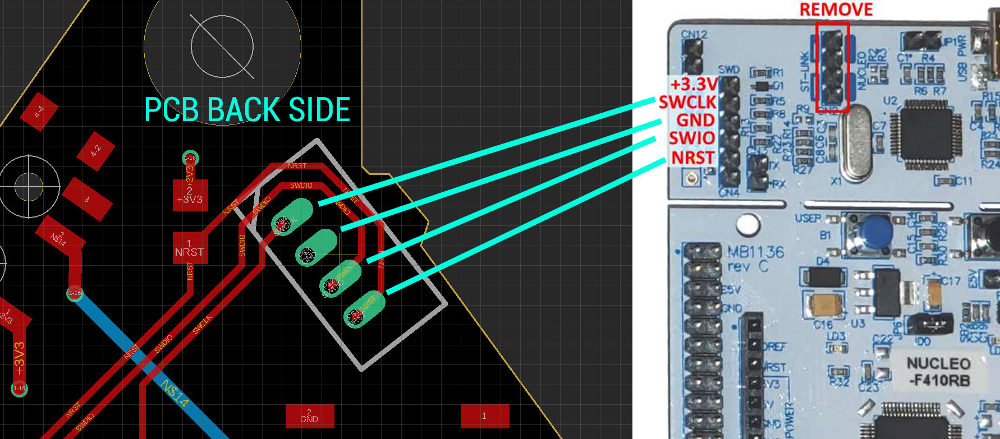
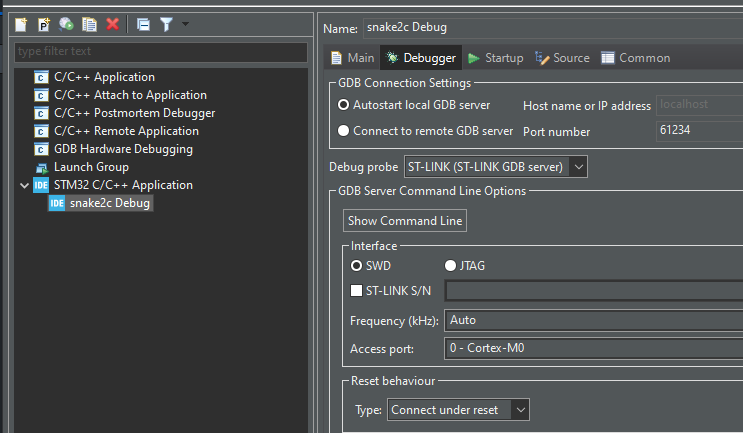

# DEFCON31 BLINKY BADGE-ADDON
This project recycles the same schematic and foundation code from my Snake Business Card. The main difference is that there is only a single button on the PCB that the user can interact with. In the development of this project, STM32 CubeMX and CubeIDE were used to configure and generate the HAL (hardware-abstraction-layer). Some says I'm cheating and using a code generator. I don't disagree XD.

To edit/compile/flash the code you only need to install CubeIDE. Although feel free to use any tools you like. 
You can download CubeIDE here: https://www.st.com/en/development-tools/stm32cubeide.html

## Code and Game Behavior
The badge-addon is loaded with a set of animation. The animation is selected in the main loop in "main.c". There is a switch statement that cycles between each animation. When the button is pressed, the animation is incremented to select a new one. Each animation is described in a specific .c/.h file
* anim_name.c 
* anim_random.c
* anim_swipe.c

You can add additional animation by adding a new .c/.h pair. Add an #include in main.c and call the your animation function in the switch statement.

## About the Timer16
The clock is set to 8Mhz and the timer16 counter is set to 1000 (see "tim.c"). Thus 8Mhz/1000=8Khz.
The timer runs at 8khz. It updates a new LED 8000 cycles per second. 

### Analogy
Imagine there is a cursor that is moving left to right, top to bottom. Every cycle, the cursor moves to the next LED, reads the buffer and decides if the LED should be on/off. In other words, it takes 64 cycles to update the full screen since there is 64 LEDs. Consequently, it takes 8000Hz/64LEDs = 125ms to update the full screen.

### Where is the timer handler?
The timer handler function "HAL_TIM_PeriodElapsedCallback()" is called in the file "stm32f0xx_it.c". At that location the "screen_interruptUpdate()" function is called to update the next LED.

## About LED Matrix
The chip we are using is the STM32F0. The datasheet indicates that the maximum current through a whole GPIO PORT is 30mA. The LEDs are running at 20mA with the chosen current limit resistor. Therefore, the code is set to only turn on 1 single LED at a time in order to satisfy that requirement. Since the whole screen is updated every 125ms, there is enough persistence of vision to produce a consistent animation.

The low-level function which controls the individual LEDs is located in "ledHandler.c". The function 
"matrix_setLed_on()" is used to enable an LED. It can be seen that at the beginning of it, it calls "matrix_setLed_allOff()" to disable any previous LEDs and ensure the PORT never source more than 30mA.

## About screenBuffer.c
The screenBuffer is how you interact with the LED matrix. There is 1 main fundamental fonction you need:
* screen_set_bit(row, column, state)

This is function set the state of each LEDs in the 8x8 matrix. It's either 1 (on) or 0 (off).

Additionally, there are helper functions to make animating easier:
* screen_get_bit()
* screen_fill()	
* screen_clear()

## How to Flash
Things you need:
* ST-Link - I personally use an STM32F0 Nucleo Board: [497-15096-ND](https://www.digikey.ca/en/products/detail/stmicroelectronics/NUCLEO-F072RB/5047984)
* Female Connector: [H2193-ND](https://www.digikey.ca/en/products/detail/hirose-electric-co-ltd/DF13-4P-1-25DSA/241767?s=N4IgTCBcDaIBJgIwE4DMBaAcgERAXQF8g)
* Male Connector: [H2181-ND](https://www.digikey.ca/en/products/detail/hirose-electric-co-ltd/DF13-4S-1-25C/241750)
* Precrimped wires x4: [H4BXG-10112-B8-ND](https://www.digikey.ca/en/products/detail/hirose-electric-co-ltd/H4BXG-10112-B8/426117)

### Instruction
* Connect the ST-Link SWD header to the PCB's programming port


* Compile the code in STM CubeIDE: "Project"->"Build All"
* Connect your Nucleo board to your computer
* Configure the debugger as follows: "Run" -> "Debug Configurations"

* Flash the firmware: "Run" -> "Run"
* You will see this in the logs
```
Memory Programming ...
Opening and parsing file: ST-LINK_GDB_server_a15460.srec
  File          : ST-LINK_GDB_server_a15460.srec
  Size          : 21.34 KB 
  Address       : 0x08000000 
Erasing memory corresponding to segment 0:
Erasing internal memory sectors [0 21]
Download in Progress:
File download complete
Time elapsed during download operation: 00:00:01.454
Verifying ...
Download verified successfully 
Shutting down...
Exit.
```